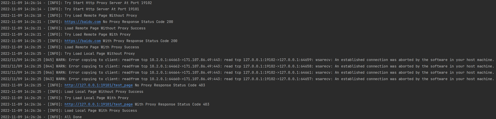
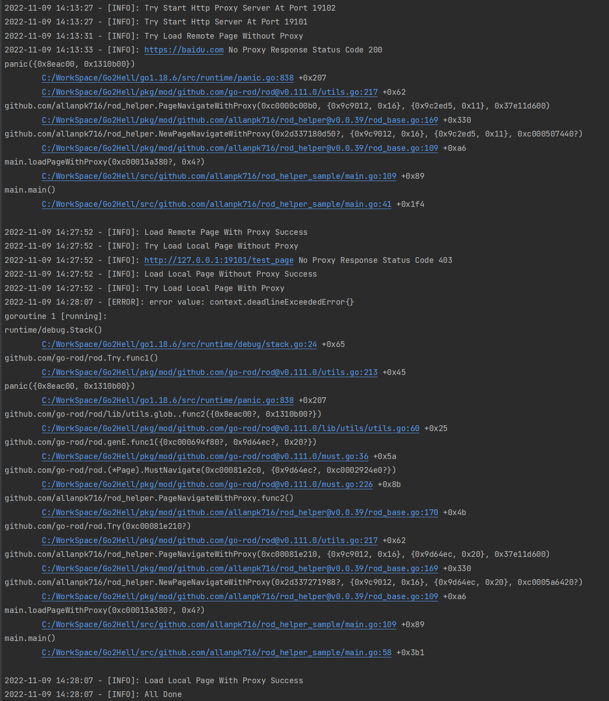

# 测试项目介绍

本项目的测试代码是根据 [memory leak by use HijackRequests() · Issue #748 · go-rod/rod (github.com)](https://github.com/go-rod/rod/issues/748) 的要求实现的。

那么这个 issues 提到了 `hijack` 的 `LoadResponse` 设置从原有的 `true` 改为 `false`，遇到访问 403 页面不会马上返回的问题。因为使用了我自己的封装库 [allanpk716/rod_helper: go-rod 的封装，适用于爬虫任务 (github.com)](https://github.com/allanpk716/rod_helper)

* `LoadResponse` 设置 `true` ，对应的库版本是 `v0.0.38`
* `LoadResponse` 设置 `false` ，对应的库版本是 `v0.0.39`

## 还原依赖

请先克隆本项目，然后在本项目的目录中执行

```go
go mod tidy
```

## 测试的流程

### 测试 true 情况

首先，测试 `LoadResponse` 设置 `true` ，对应的库版本是 `v0.0.38`

需要设置对应的库版本

```shell
go get github.com/allanpk716/rod_helper@v0.0.38
```

找到 `main.go` 文件，执行 `go run main.go` 即可开始测试。

日志如下：



可以看到，都是很快就返回，哪怕设置的超时时间是 15s，都是瞬间返回。

### 测试 false 情况

然后，测试 `LoadResponse` 设置 `false` ，对应的库版本是 `v0.0.39`

需要设置对应的库版本

```shell
go get github.com/allanpk716/rod_helper@v0.0.39
```

找到 `main.go` 文件，执行 `go run main.go` 即可开始测试。



可以看到，403 情况下，都需要等待超时完毕才会继续。等够了 15s。

## 测试思路

下面会解释代码测试的思路。

首先，会开启两个 Server（日志如下）：

* 一个是模拟本地的 403 返回值的网站
* 一个是模拟本地的 http 代理服务器

```shell
2022-11-09 14:13:27 - [INFO]: Try Start Http Proxy Server At Port 19102
2022-11-09 14:13:27 - [INFO]: Try Start Http Server At Port 19101
```

然后，会先通过访问 `baidu.com` 测试正常网站的执行效果。

然后再通过访问上面开启的 本地HTTP 服务器，看执行效果。
